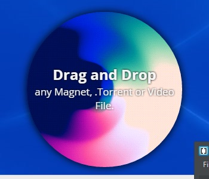
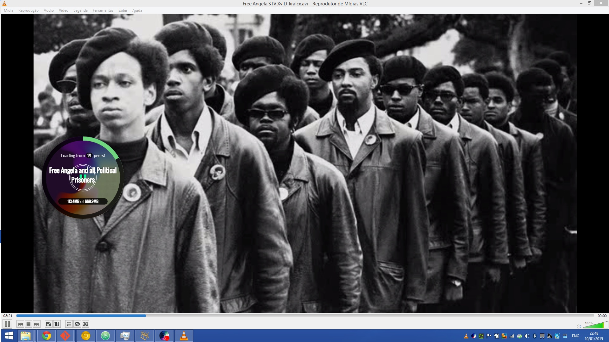
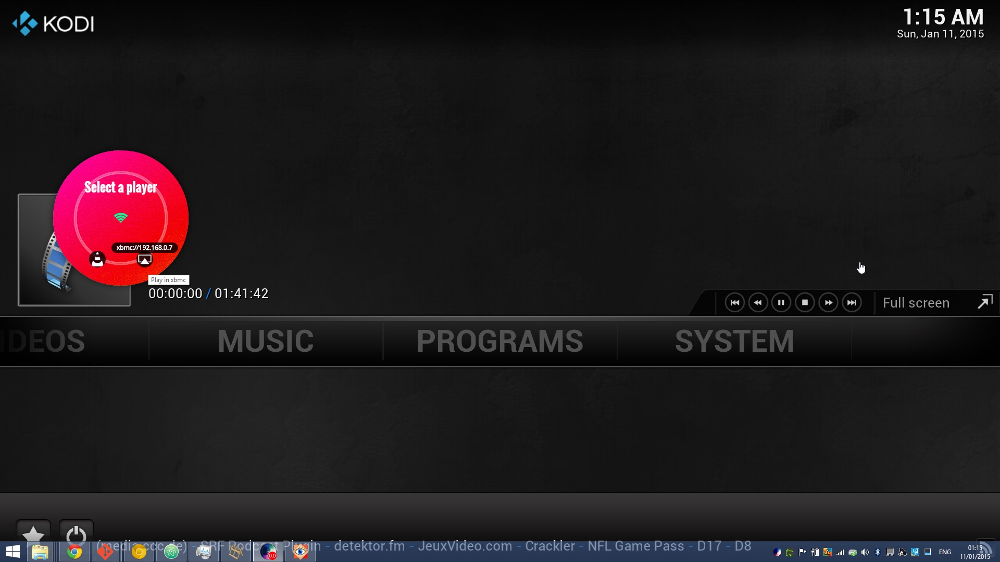

# [TorrenTV](https://github.com/torrentv/torrentv)

This is a fork of TorrenTV, a direction towards 1.0, more
stable, less hackish and easier to add new features/players.

--

-- 

Stream any Torrent to your AppleTV via AirPlay

Also, there is a Channel to stream to Roku Devices: https://owner.roku.com/add/KHN8M

## Development status:

Working on compatibility for Chromecast and Roku...

Visit the project's website at <http://torrentv.github.io>.

#### Quickstart for developers:

1. `npm install -g grunt-cli bower`
1. `npm install`
1. `grunt build`
1. `grunt start`

#### Create Windows, Linux32bits, Linux 64bits and Mac Executables and Installers:

1. `grunt dist`
